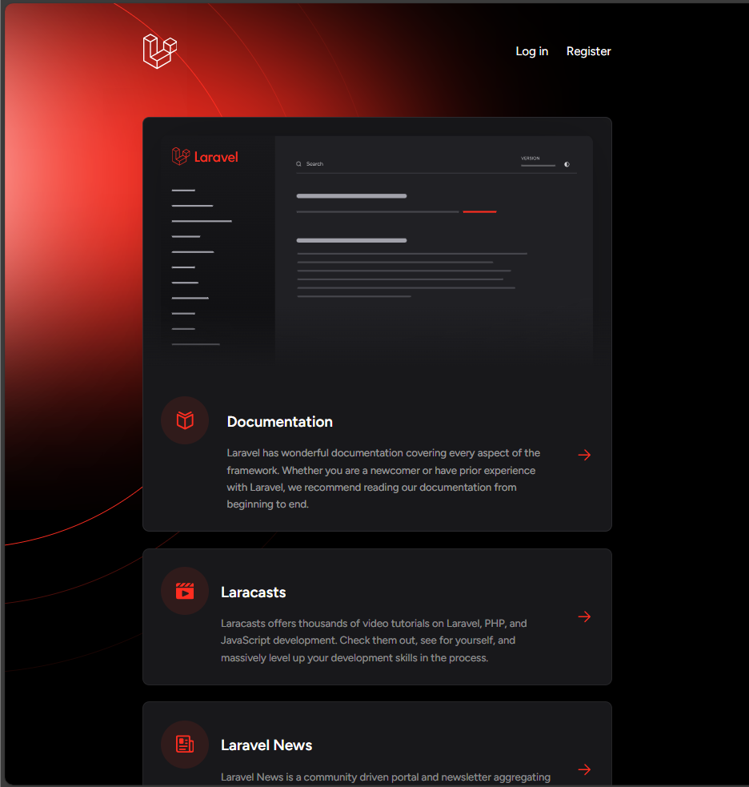

# Software Requirement Specification (SRS) - Julie Toys

## BAB I Pendahuluan

### 1.1 Tujuan
Dokumen ini bertujuan untuk menggambarkan spesifikasi sistem perangkat lunak yang akan digunakan untuk membangun **Sistem Informasi Julie Toys**, sebuah toko online yang menjual berbagai mainan anak. SRS ini akan menjadi panduan teknis bagi pengembang dalam membangun dan mengelola aplikasi yang dapat diakses oleh admin dan pembeli.

### 1.2 Lingkup
Sistem Informasi Julie Toys adalah aplikasi berbasis web yang menyediakan pengelolaan produk mainan, proses belanja, dan pencatatan riwayat transaksi. Fungsi utama dalam aplikasi ini meliputi:
- **Shop (Toko):** Menampilkan produk mainan yang tersedia untuk dibeli.
- **Riwayat Pembelian:** Pembeli dapat melihat transaksi pembelian mereka.
- **Laporan Keuntungan:** Admin dapat mengakses laporan keuntungan.
- **Tambah Produk:** Admin dapat menambahkan produk baru.
- **FAQ:** Halaman pertanyaan umum untuk pembeli dan admin.

##1.3 Akronim, singkatan, definisi
| Istilah | Definisi                                                               |
|---------|------------------------------------------------------------------------|
|  login  | Proses masuk ke akun dengan email/username dan password.               |
| register| Proses membuat akun baru dengan mengisi data seperti nama dan email.   |
| Use Case| Cara pengguna berinteraksi dengan sistem untuk mencapai tujuan.        |
|   FAQ   | Daftar pertanyaan dan jawaban umum tentang layanan atau produk.        |

## BAB II Gambaran Umum
Pada sistem Julie Toys, terdapat dua jenis pengguna: Admin dan Pembeli. Admin memiliki hak akses penuh terhadap sistem untuk mengelola produk, melihat laporan keuntungan, dan membuat laporan transaksi, sementara Pembeli dapat mengakses katalog produk dan melakukan pembelian, serta melihat riwayat pembelian mereka.

Fitur utama yang ada dalam aplikasi adalah:
- **Shop (Toko): Pengunjung (pembeli) dapat melihat produk mainan yang tersedia untuk dibeli.
- **Riwayat Pembelian: Pembeli dapat memeriksa riwayat transaksi mereka.
- **Laporan Keuntungan: Hanya admin yang dapat mengakses dan melihat laporan keuntungan yang dihasilkan oleh toko.
- **Tambah Produk: Admin dapat menambah produk baru yang akan muncul di toko.
- **FAQ: Halaman FAQ yang dapat diakses oleh admin dan pembeli untuk menjawab pertanyaan umum terkait produk dan transaksi.

### 2.1 Perspektif Produk
Julie Toys adalah toko mainan online yang dapat diakses melalui web. Sistem ini memiliki dua jenis aktor utama:
- **Admin:** Mengelola produk, memantau transaksi, dan melihat laporan keuntungan.
- **Pembeli:** Membeli produk dan melihat riwayat pembelian mereka.

### 2.1.1 Antarmuka Sistem
- **Halaman Admin:**
  - Login dan register.
  - Tambah/edit/hapus produk.
  - Laporan keuntungan.
  - Manajemen riwayat pembelian.
  - Manajemen FAQ.
  - Daftar akun pembeli.
- **Halaman Pembeli:**
  - Melihat produk.
  - Melakukan pembelian.
  - Mengakses riwayat pembelian dan halaman FAQ.

**2.1.2 Antarmuka Pengguna**

**Halaman Admin**
|  |  |
|--|--|
|  halaman login admin diminta untuk mengisi username dan password.|  Setelah login admin akan masuk ke tampilan Dashboard admin.
|  |  |
|  Pada halaman admin akan terdapat halaman unutk mengelola data kegiatan, namun tidak hanya dat kegiatan tapi admin juga dapat mengelola data artikel, data kontak, data about dan data team dengan tamnpilan yang sama di halaman yang berbeda.|  Pada halaman mengelola data kegiatan, admin juga dapat menambahkan data kegiatan, begitu juga dengan pengelolaan data di tabel lainnya.
|  |  |
|  Pada halaman mengelola data kegiatan juga terdapat aksi untuk mengedit data kegiatan.| Pada halaman mengelola data kegiatan, selain menambahkan dan mengedit, admin juga dapat menghapus data kegiatan yang mana ketika button hapus di klik akan muncul pop up untuk memastikan admin benar-benar ingin menghapus atau tidak.

**Halaman User**
|  |  |
|--|--|
|  Pada halaman pengunjung terdapat beranda yang berisi tampilan scrolling yang berisi seluruh konten seperti tampilan home, kegiatan, artikel about ,team dan contact.| Pada halaman pengunjung terdapat halaman kegiatan yang berisi judul, gambar, tanggal dan deskripsi kegiatan.
|  |  |
|  Pada halaman pengunjung terdapat halaman lanjutan Kegiatan, jika pengunjung telah mengklik satu kegiatan yang akan dilihat, maka pada halaman ini akan tampil deskripsi dari kegiatan tersebut.| Pada halaman pengunjung terdapat halaman artikel yang berisi cover dan deskripsi singkat mengenai artikel.
|  |  |
|  Pada halaman pengunjung terdapat halaman lanjutan Artikel jika pengunjung telah mengklik satu judul yang akan dibaca, maka pada halaman ini akan tampil deskripsi dari artikel tersebut, pada halaman ini pengunjung dapat meninggalkan komentar.| Pada halaman pengunjung terdapat halaman about yang berisi informasi website seputar pengelola.
|  |  |
|  Pada halaman pengunjung terdapat halaman about yang berisi informasi website seputar Alamat dan Contact Person.| Pada halaman pengunjung terdapat halaman team yang berisi team dari dinas pemberdayaan perempuan dan Perlindungan anak masyarakat kota pekanbaru.

### **2.1.3 Antarmuka perangkat keras**

Antarmuka perangkat keras yang digunakan untuk mengoperasikan Perangkat Lunak Sistem Parenting antara lain :

PC / Laptop Untuk menjalankan Aplikasi ini.
### 2.1.3 Antarmuka Perangkat Lunak
- Browser web modern (Chrome, Firefox, Safari, Edge).

### 2.1.4 Operasi
- **Login:** Untuk autentikasi pengguna.
- **Input Data:** Untuk menambahkan informasi baru.
- **Edit:** Untuk mengubah informasi.
- **Hapus:** Untuk menghapus informasi.
- **Simpan:** Untuk menyimpan data ke sistem.

### 2.2 Spesifikasi Kebutuhan Fungsional
- **Admin Login:** Autentikasi menggunakan username dan password.
- **Manajemen Produk:** Admin dapat menambah, mengedit, atau menghapus produk.
- **Riwayat Pembelian:** Admin dan pembeli dapat melihat riwayat transaksi.
- **FAQ Management:** Admin dapat menambah atau mengedit FAQ.

### 2.3 Spesifikasi Kebutuhan Non-Fungsional
| No | Deskripsi                                                                 |
|----|---------------------------------------------------------------------------|
| 1  | Semua antarmuka menggunakan Bahasa Indonesia.                             |
| 2  | Sistem kompatibel dengan berbagai platform OS.                            |
| 3  | Sistem mampu menangani transaksi pembelian dengan aman dan cepat.        |
| 4  | Laporan keuntungan disajikan dalam bentuk grafik yang mudah dipahami.    |
| 5  | Halaman FAQ mudah diakses oleh pengguna.                                 |

## BAB III Requirement Specification

### 3.1 Kebutuhan Fungsional

Kebutuhan fungsional sistem Julie Toys mencakup berbagai fitur yang harus ada untuk mendukung operasional aplikasi e-commerce dalam jual beli mercun secara online. Fitur-fitur ini bertujuan untuk memberikan pengalaman pengguna yang optimal dan efisien. Adapun kebutuhan fungsional yang harus ada dalam sistem ini meliputi:

1. **Manajemen Pengguna:**
   - Pengguna dapat membuat akun, login, dan logout dari aplikasi.
   - Pengguna dapat memperbarui data profil, termasuk informasi pengiriman dan pembayaran.
   - Admin dapat mengelola data pengguna, termasuk hak akses (sebagai admin atau pelanggan).

2. **Manajemen Produk:**
   - Admin dapat menambahkan, mengedit, atau menghapus produk yang dijual di platform.
   - Pengguna dapat mencari, melihat, dan memfilter produk berdasarkan kategori atau harga.
   - Pengguna dapat melihat detail produk, termasuk gambar, deskripsi, harga, dan stok yang tersedia.

3. **Proses Pembelian:**
   - Pengguna dapat menambahkan produk ke keranjang belanja dan mengeditnya.
   - Pengguna dapat melanjutkan ke proses checkout untuk menyelesaikan pembelian.
   - Sistem mendukung berbagai metode pembayaran yang aman dan dapat diintegrasikan dengan sistem pembayaran online.

4. **Pelaporan Keuntungan:**
   - Admin dapat melihat laporan keuntungan berdasarkan penjualan yang terjadi dalam jangka waktu tertentu.
   - Laporan dapat mencakup detail transaksi, produk yang paling laku, dan pendapatan yang diperoleh.

5. **Fitur FAQ:**
   - Pengguna dapat mengakses halaman FAQ untuk mencari jawaban atas pertanyaan umum mengenai produk, pengiriman, atau kebijakan pembelian.
   - Admin dapat mengelola dan memperbarui isi FAQ sesuai kebutuhan.

Dengan adanya kebutuhan fungsional ini, sistem Julie Toys diharapkan dapat memberikan pengalaman yang lancar dan aman bagi penggunanya, serta mempermudah pengelolaan dan operasi bisnis secara keseluruhan.

#### 3.1.1 Fungsi Admin
- Login menggunakan username dan password.
- Tambah/edit/hapus produk.
- Lihat laporan keuntungan.
- Tambah/edit/hapus FAQ.
- Melihat daftar member.
- Akses riwayat pembelian.

#### 3.1.2 Fungsi Pembeli
- Melihat daftar produk.
- Pencarian produk.
- Membeli produk.
- Melihat riwayat pembelian.
- Akses halaman FAQ.

### 3.2 Kebutuhan Non-Fungsional
#### 3.2.1 Keamanan
- Autentikasi menggunakan username dan password terenkripsi.
- Perlindungan dari serangan seperti SQL injection, XSS, dan CSRF.

#### 3.2.2 Kinerja
- Kecepatan akses optimal.
- Skalabilitas untuk menangani lonjakan pengguna.
- Downtime minimal.

#### 3.2.3 Usability
- Antarmuka mudah digunakan dan responsif.

#### 3.2.4 Kompatibilitas
- Mendukung browser modern.
- Mobile-friendly.

#### 3.2.5 Backup dan Pemulihan
- Backup otomatis setiap hari.
- Rencana pemulihan jika terjadi kegagalan sistem.

## BAB IV Desain Sistem

### 4.1 Arsitektur Sistem
- **Client-Server Architecture**:
  - **Frontend:** HTML, CSS, JavaScript.
  - **Backend:** PHP dan MySQL.
  - **Database:** Menyimpan data produk, pengguna, dan transaksi.

### 4.2 Desain Database
#### Tabel Produk
| Kolom             | Tipe Data   | Deskripsi                                |
|-------------------|------------|----------------------------------------|
| ID                | INTEGER     | Identifikasi unik untuk setiap produk dalam database. |
| NAME              | VARCHAR     | Nama produk.                            |
| PRICE             | DECIMAL     | Harga produk dalam format desimal (contoh: Rp100.000,50). |
| STOCK             | INTEGER     | Jumlah produk yang tersedia di stok toko. |
| DESCRIPTION       | TEXT        | Penjelasan rinci tentang produk, seperti ukuran, warna, dll. |
| CREATED_AT        | DATETIME    | Tanggal dan waktu data produk pertama kali dibuat. |
| UPDATED_AT        | DATETIME    | Tanggal dan waktu terakhir data diperbarui. |
| IS_AVAILABLE_ONLINE | INTEGER   | Status ketersediaan online (0 = tidak tersedia, 1 = tersedia). |
| IMAGE             | VARCHAR     | URL atau path ke gambar produk.         |

#### Tabel Riwayat Pembelian
| Kolom          | Tipe Data   | Deskripsi                                  |
|----------------|------------|------------------------------------------|
| ID             | INTEGER     | Identifikasi unik untuk setiap transaksi atau pembelian. |
| PRODUCT_ID     | INTEGER     | Referensi ke produk yang dibeli.          |
| PURCHASE_DATE  | DATE        | Tanggal saat pembelian dilakukan.         |
| QUANTITY       | INTEGER     | Jumlah produk yang dibeli.                |
| TOTAL_PRICE    | DECIMAL     | Total harga transaksi.                    |
| CREATED_AT     | TIMESTAMP   | Tanggal dan waktu data transaksi dibuat.  |
| UPDATED_AT     | TIMESTAMP   | Tanggal dan waktu terakhir data diperbarui. |
| RATING         | INTEGER     | Penilaian yang diberikan pelanggan (skala 1–5). |

#### Tabel Pengguna (Users)
| Kolom          | Tipe Data   | Deskripsi                                  |
|----------------|------------|------------------------------------------|
| ID             | INTEGER     | Identifikasi unik untuk setiap pengguna.  |
| NAME           | VARCHAR     | Nama lengkap pengguna.                    |
| EMAIL          | VARCHAR     | Alamat email pengguna.                    |
| EMAIL_VERIFIED_AT | TIMESTAMP | Tanggal dan waktu verifikasi email.       |
| PASSWORD       | VARCHAR     | Kata sandi terenkripsi.                   |
| REMEMBER_TOKEN | VARCHAR     | Token untuk menjaga sesi pengguna.        |
| CREATED_AT     | TIMESTAMP   | Tanggal dan waktu data dibuat.            |
| UPDATED_AT     | TIMESTAMP   | Tanggal dan waktu terakhir data diperbarui. |
| ROLE           | VARCHAR     | Peran pengguna, seperti "admin" atau "buyer". |

#### Tabel FAQ
| Kolom          | Tipe Data   | Deskripsi                                  |
|----------------|------------|------------------------------------------|
| ID             | INTEGER     | Identifikasi unik untuk setiap pertanyaan FAQ. |
| QUESTION       | TEXT        | Pertanyaan yang diajukan terkait produk atau layanan. |
| ANSWER         | TEXT        | Jawaban atas pertanyaan tersebut.         |
| CREATED_AT     | DATETIME    | Tanggal dan waktu data FAQ ditambahkan.   |

## BAB V Uji Coba dan Validasi Sistem

### 5.1 Metode Pengujian
Untuk memastikan bahwa sistem Julie Toys berfungsi dengan baik dan aman digunakan, dilakukan berbagai metode pengujian yang terbagi dalam dua kategori utama:

1. **Pengujian Fungsional:**
   - **Login:** Pengujian untuk memastikan proses login pengguna berjalan dengan lancar dan aman.
   - **Pembelian Produk:** Pengujian untuk memastikan alur pembelian produk dapat dilakukan dengan baik, mulai dari pemilihan produk hingga pembayaran.
   - **Manajemen Produk dan FAQ:** Pengujian untuk memastikan fitur manajemen produk, serta penyediaan informasi melalui FAQ berjalan dengan efektif.

2. **Pengujian Keamanan:**
   - **SQL Injection:** Pengujian untuk mendeteksi potensi kerentanannya terhadap serangan SQL Injection yang dapat merusak integritas data.
   - **Cross-Site Scripting (XSS):** Pengujian untuk memeriksa apakah sistem rentan terhadap XSS, yang dapat memungkinkan eksekusi skrip berbahaya di sisi klien.
   - **Cross-Site Request Forgery (CSRF):** Pengujian untuk memastikan aplikasi aman dari potensi CSRF, yang dapat mengeksploitasi sesi pengguna yang sah untuk melakukan aksi yang tidak diinginkan.

### 5.2 Uji Coba Pengguna
Setelah pengujian teknis dilakukan, tahap selanjutnya adalah uji coba oleh pengguna. Pada tahap ini, sejumlah pengguna yang telah dipilih untuk menguji sistem memberikan feedback terkait pengalaman mereka dalam menggunakan aplikasi Julie Toys. Feedback tersebut mencakup berbagai aspek, seperti:

- Kemudahan navigasi aplikasi.
- Proses pembelian yang mudah dipahami.
- Fitur yang dirasa kurang atau perlu diperbaiki.

Hasil dari uji coba pengguna akan digunakan untuk menyempurnakan sistem agar lebih user-friendly, efisien, dan dapat memenuhi kebutuhan pengguna dengan lebih baik.

## BAB VI Penutupan

### 6.1 Kesimpulan
Sistem Julie Toys adalah sebuah aplikasi e-commerce yang dirancang khusus untuk memfasilitasi proses jual beli mercun secara online. Aplikasi ini memiliki berbagai fitur utama yang bertujuan untuk memberikan pengalaman yang efisien dan memudahkan pengguna dalam bertransaksi, antara lain:

- **Manajemen Produk**: Memungkinkan pengelolaan produk dengan mudah.
- **Laporan Keuntungan**: Membantu pemilik bisnis untuk memantau performa keuangan.
- **FAQ**: Memberikan informasi penting bagi pelanggan.

Dengan sistem ini, diharapkan dapat meningkatkan kenyamanan, kecepatan, dan kemudahan bagi pengguna dalam berbelanja mercun, serta memberikan keuntungan yang maksimal bagi penjual.

### 6.2 Rencana Pengembangan
- Integrasi pembayaran online.
- Perhitungan otomatis ongkos kirim.
- Penambahan sistem diskon dan promo.
